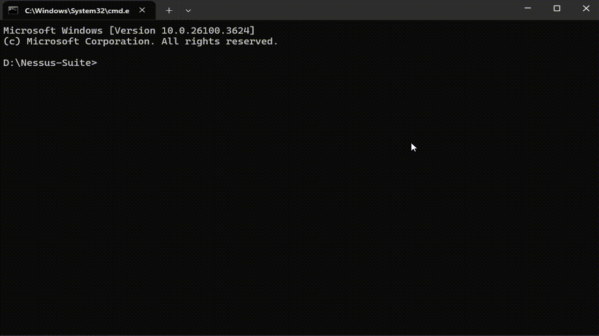

# Nessus Suite - Tool for Managing Tenable Nessus ✡
     

    Nessus Suite is a Python CLI tool designed to make you're day-to-day interaction with Nessus easier.
    The script detects the Nessus installation OS and works accordingly.
---
## 👋 Connect with Me
 [](https://www.linkedin.com/in/yair-avramovitch) 

## Disclaimer

This project is intended for **educational purposes only**.  
The author is not responsible for any misuse or damage caused by the use of this software.  
Do not misuse the trial key generation, Use responsibly and in accordance with all applicable laws and regulations.

---
## 🚀 Features
- **🔐 Trial Key Generation**
  - Automatically generate 7-day trial keys for Nessus **Professional** or **Expert**
- **🧩 Plugin Management**
  - Check the latest plugin versions
  - Download full plugin archives
  - Install plugins from archives or fetch updates directly
- **👤 User Management**
  - Add, modify & delete users/passwords and list Nessus users
- **🖠️ Service Control**
  - Start, stop, restart, and check the status of the Nessus daemon
- **📄 License & Activation**
  - Register licenses online or offline
  - Generate offline challenges and view active license details
- **🔧 Nessus CLI Tools**
  - Reset configuration
  - View logs, system diagnostics, and event logs
  - Backup and restore configurations
  - Bind Nessus to a specific IP/port
- **📅 Installer Downloads (Some Requires Authorization)**
  - Automatically fetch and download installers for:
    - Nessus Core/Agents
    - Tenable OT Security
    - Tenable Security Center
    - Sensor Proxy and more
---
## 🎮 Demo

MP4 available  <a href="./images/demo.mp4" target="_blank">here</a>


## ⚙️ Prerequisites
Ensure the following are installed:
- **Python 3.7+** 🐍
- **Tenable Nessus (Only for Nessus operations, rest of the script will work just fine)**
---
## 🎬 Installation, super tough!
```bash
git clone https://github.com/Y8765/Nessus-Suite.git
cd Nessus-Suite
pip install -r requirements.txt
```

## 🧠 Usage
```bash
python3 Nessus_Suite.py
```
⚠️ **Important:** 
---
Use Admin/root privileges for running Nessus Useful Commands (Main menu, option 3).

You'll be greeted with an interactive menu:
```
=== Nessus Suite Main Menu ===
1. Generate Keys
2. Plugin Stuff
3. Nessus Useful Commands (Admin/Root Is Needed)
4. Download Nessus Installers
5. Download Other Tenable Products
6. Exit
```

## 📦 Compiled Binaries
For convenience, compiled Windows and Linux binaries are attached.  
These were created using auto-py-to-exe, which leverages PyInstaller for packaging.              
**Note**: Some AV/EDR providers might flag those binaries as malicious due to pyinstaller.  
If it happens, you can always use the original Python script source instead.

## 🤝 Contributing
Want to improve or add a new feature? Fork it!

## 📄 License
This project is licensed under the MIT License.

## 🙏 Thank you's
Chatgpt, Grok, Deepseek, Gemini, Copilot & Claude, For proving me that in the end, maunal work is still needed 🤖